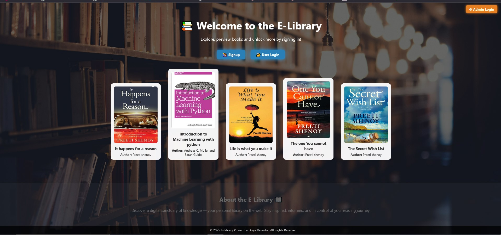

E-Library System with Search & Bookmark

📸 Project Screenshot

🌟 Objective

Develop a Django-based e-library system that allows users to upload, search, read, bookmark, and download e-books in PDF format. The system supports SQLite-based search, user-specific bookmarks, and a clean, interactive user interface.

📆 Core Features

1. 📚 Book Management

**Admin-only functionality**

* **Upload Page**

  * Fields: Title, Author, PDF File, Thumbnail Image
  * Validations: PDF only for files; JPG/JPEG/PNG for thumbnails

* **Dashboard**

  * View all uploaded books
  * Edit or delete books
  * View download counts per book

2. 📄 User Interface

* **Welcome Page** (Public):

  * Landing page showing book previews with login/signup CTA

* **Library Listing Page** (Post-login):

  * Shows all books with: thumbnail, title, author
  * Buttons: Download, Bookmark, Read Online
  * Pagination (10 books/page)

* **Book Detail Page**

  * Embedded PDF viewer (inline reading)
  * Download button with download count tracking
  * Bookmark toggle button (Add/Remove Bookmark)

3. 🔍 Full-Text Search

* Powered by SQLite-based case-insensitive search
* Fields: Title, Author
* Available on Library page with live results filtering

4. 🔢 Pagination & Filtering

* Server-side pagination (10 books per page)
* Filters include:

  * By Author (dropdown)
  * By Title (search)
  * "Only My Bookmarks" (checkbox for logged-in users)

5. 📌 Bookmark Feature (User-specific)

* Toggle bookmark on/off per book
* Bookmarked books accessible under "My Bookmarks"

6. ⬇️ Download Count Tracking

* Downloads tracked per book
* Count only increments on actual downloads

📄 User Roles

✉️ Admin:

* Upload/edit/delete books
* Monitor download counts
* View all activity

🙋 Registered User:

* Browse/search books
* Download and read online
* Bookmark/unbookmark books

🧰 Tech Stack

* Django
* SQLite
* HTML5, Bootstrap
* JavaScript (for interactivity)
* Custom CSS for UI polish

🏗️ Project Structure (Key Apps)

├── accounts        # Custom signup, login, logout with email verification
├── library         # Core app for book models, bookmarks, views
├── templates       # HTML templates
├── media/          # Uploaded PDFs and thumbnails
├── static/         # CSS/JS files
├── e_library_project/   # Project settings and URLs

📅 Deployment Guide

1. Clone the repository
2. Set up virtual environment
3. Install dependencies
4. Create `.env` or use `python-decouple` for secrets
5. Apply migrations
6. Create superuser
7. Run the server

python manage.py makemigrations
python manage.py migrate
python manage.py createsuperuser
python manage.py runserver

📍 License

This project is for academic and educational use.
